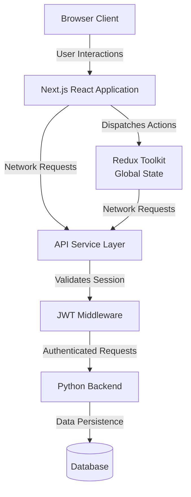

# Access to Credit System

## Overview
The Access to Credit System is a production frontend application built to handle the end-to-end loan application and lead management process. It is designed with performance, type safety, and maintainability as primary constraints.

---

## System Architecture

The application is built on Next.js using the App Router. It implements a repository pattern for data fetching, centralizing API interactions through an abstraction layer.

State is divided into two distinct domains:
1. **Global State**: Managed by Redux Toolkit for complex UI interactions, wizard state progression, server data synchronization, and global connectivity monitoring.



---

## Directory Structure

Below is the complete, file-system mapping of the project structure showing where all files are located and how functionalities are modularized.

### Root Directory
- **`src/`**: Central application source code (routing, UI components, business logic, state management, utilities).
- **`public/`**: Static public assets, image resources, and fonts.
- **`mocks/`**: Mock Service Worker (MSW) client setup, route interceptor handlers, and static mocked JSON data.
- **Configuration Files**:
  - `package.json` / `pnpm-lock.yaml`: Dependencies, build scripts, and lockfiles.
  - `tsconfig.json`: TypeScript configurations.
  - `tailwind.config.ts` / `postcss.config.mjs`: CSS styling extensions.
  - `vitest.config.ts`: Unit and integration testing configurations.
  - `Dockerfile` / `docker-compose.yaml` / `nginx.conf`: Deployment and container config.
  - `Jenkinsfile`: CI/CD automation pipelines.

### `src/` Folder Breakdown

```
src/
├── app/                   # Next.js App Router routing infrastructure
│   ├── (dashboard)/       # Layout protecting sub-routes (leads, loans)
│   │   ├── leads/         # Lead list and wizard endpoints
│   │   ├── loans/         # Loan status and credit check pages
│   │   └── loan-application-dashboard/ # Loan application summary page
│   ├── api/               # Server-side proxy API routes
│   ├── login/             # Login routing and entry
│   ├── layout.tsx         # Global HTML document shell
│   ├── providers.tsx      # Global context hooks (Redux, MSW initialization)
│   └── proxy.ts           # Route middleware intercepting session redirectors
│
├── components/            # Reusable UI primitives and layout shells
│   ├── ui/                # High-fidelity form controls and modals
│   ├── Sidebar.tsx        # Dashboard navigation side panel
│   └── TopHeader.tsx      # Global application navbar and profile menu
│
├── features/              # Feature modules representing distinct business domains
│   ├── auth/              # JWT storage, session validation, authentication hooks
│   ├── leads/             # Dashboard tracking, filtering, status badges
│   ├── loans/             # Active credit checking and application monitoring
│   ├── new-lead/          # Multi-slice wizard managing registration steps
│   └── new-loan/          # Wizard for client consent and underwriting step inputs
│
├── hooks/                 # Custom global React hooks
│   └── useClickOutside.ts # Hook detecting user clicks outside target elements
│
├── lib/                   # Project utilities and configurations
│   ├── api/               # API clients with fetch request middleware
│   ├── logger.ts          # Central console and production logger
│   └── utils.ts           # CSS merging (cn), string formatting, and normalizers
│
├── store/                 # Global Redux Store configurations
│   └── index.ts           # Combined state slice registration and type mapping
│
├── styles/                # Styling variables, global CSS, and layout sheets
│
└── types/                 # Shared system-wide TypeScript declarations
    └── api.ts             # Generic HTTP responses and pagination typing
```

---

## Feature & Functionality Division

The system segregates business domains and functionalities into dedicated directories to enforce strict separation of concerns:

### 1. Authentication (`src/features/auth`)
*   **Purpose**: Manages JWT credentials, session tracking, token state, and redirection.
*   **Key Files**:
    *   `src/features/auth/api/auth.service.ts`: Backend auth login client.
    *   `src/features/auth/store/authSlice.ts`: Session storage parsing and client state persistence.

### 2. Lead Management (`src/features/leads`)
*   **Purpose**: Renders the main dashboard showcasing active lead metrics, columns sorting, list pagination, and custom filters.
*   **Key Files**:
    *   `src/features/leads/components/LeadDashboard.tsx`: Main table dashboard.
    *   `src/features/leads/components/LeadStatusBadge.tsx`: Color-coded status chip mappings.
    *   `src/features/leads/store/leadSlice.ts`: Active filtering, pagination parameters, and column display state.

### 3. New Lead Enrollment Wizard (`src/features/new-lead`)
*   **Purpose**: A multi-step flow capturing prospective credit client details. To optimize performance and prevent unnecessary global component re-renders, the state is split across specialized domain slices:
    *   **Farmer Profiling (`farmerSlice.ts`)**: Manages inputs like Name, Address, Contact Info, and Profile creation.
    *   **Consent Management (`consentSlice.ts`)**: Handles authorization verification and OTP validations.
    *   **Visit Planner (`visitSlice.ts`)**: Handles scheduling visits and location scheduling.
    *   **Assignment System (`assignmentSlice.ts`)**: Handles lead ownership assignment.
    *   **Root Wizard Slice (`newLeadSlice.ts`)**: Coordinates interaction histories, credit references, and active progress trackers.

### 4. New Loan Application Wizard (`src/features/new-loan`)
*   **Purpose**: A multi-stage application flow initiated on a lead record to verify, review, and submit credit proposals.
*   **Flow Stages**:
    *   **Step 1: Consent (`Step1ConsentDocs.tsx`)**: Collecting and archiving statutory authorization documents.
    *   **Step 2: Profile Check (`Step2FarmerDetails.tsx`)**: Underwriting reviews of applicant profile details.
    *   **Step 3: Submit (`Step3ReviewSubmit.tsx`)**: Double check details and execute API payload.
    *   **State Control (`newLoanFormSlice.ts`)**: Validates stages and maps form models.

### 5. Loan Management (`src/features/loans`)
*   **Purpose**: Renders the central loan dashboard tracking submitted credit applications, with KPI summaries, robust filtering, and table views for loan status tracking.
*   **Key Files**:
    *   `src/features/loans/components/LoanTable.tsx`: Main data grid displaying loan application status.
    *   `src/features/loans/components/LoanAdvancedFilters.tsx`: Advanced filter panel for searching loans by status, amount, type, and date range.
    *   `src/features/loans/store/loanDashboardSlice.ts`: Client-side state handling for filters, search parameters, and view configurations.

---

## Technical Context & Guidelines

1.  **Strict TypeScript Rules**: Strict mode is enabled. No `any` is allowed; rely on interfaces and explicit type mappings.
2.  **State Separation**: Custom component state remains localized, while wizard progression, API caching, and complex interaction states use Redux Slices.
3.  **Authentication Enforcement**: Route guarding is handled in `src/proxy.ts` middleware checking cookie presence before granting access to dashboard components.
4.  **Local Mocking**: To enable disconnected development, set `NEXT_PUBLIC_API_MOCKING=true` in `.env.local` to trigger Mock Service Worker intercepting API calls via `src/mocks/browser`.
